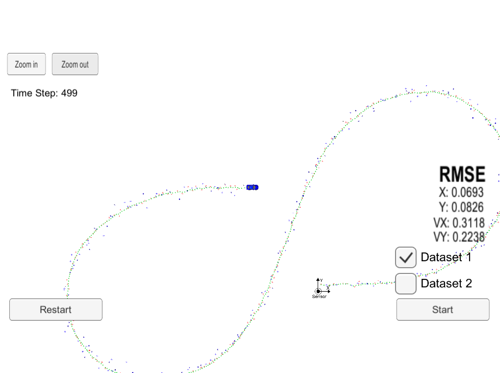

# Unscented Kalman Filter



Unscented Kalman Filter C++ implementation to estimate the state of a moving object of interest with noisy lidar and radar measurements.

We calculate the root mean squared error of each measurement prediction with the real state position(Px,Py) and velocity(Vx,Vy) of the object.

The NIS "Normalized Innovation Squared" is calculated as well and displayed using a Ipython Jupyter Notebook.

---

INPUT:

```
Lidar or radar measurement from sensors on-board:
["sensor_measurement"]
```

OUTPUT:

```
UKF estimated positions:
["estimate_x"]
["estimate_y"]

Root mean square errors for positions and velocities using real pose values:
["rmse_x"]
["rmse_y"]
["rmse_vx"]
["rmse_vy"]
```

## Dependencies

* [uWebSocketIO](https://github.com/uWebSockets/uWebSockets) 
* cmake >= v3.5
* make >= v4.1
* gcc/g++ >= v5.4

## Build

1. Make a build directory: `mkdir build && cd build`
3. Compile: `cmake .. && make`
4. Run: `./UnscentedKF path/to/input.txt path/to/output.txt`.

## XCode project generator
```
mkdir build
cd build
cmake -G Xcode ..
```

## References

<a name="ref1">[1]</a> "A New Extension of the Kalman Filter to Nonlinear Systems:,
S. J. Julier and J. K. Uhlmann,
https://www.cs.unc.edu/~welch/kalman/media/pdf/Julier1997_SPIE_KF.pdf

<a name="ref2">[2]</a> "Unscented Filtering for Spacecraft Attitude Estimation", John L.
Crassidis and F. Landis Markley, http://www.acsu.buffalo.edu/~johnc/uf_att.pdf

<a name="ref3">[3]</a> "The Square-Root Unscented Kalman Filter for State and Parameter-Estimation",
Rudolph van der Merwe and Eric A. Wan,
http://citeseerx.ist.psu.edu/viewdoc/download?doi=10.1.1.80.1421&rep=rep1&type=pdf


> MIT License Copyright (c) 2017 Alberto Naranjo